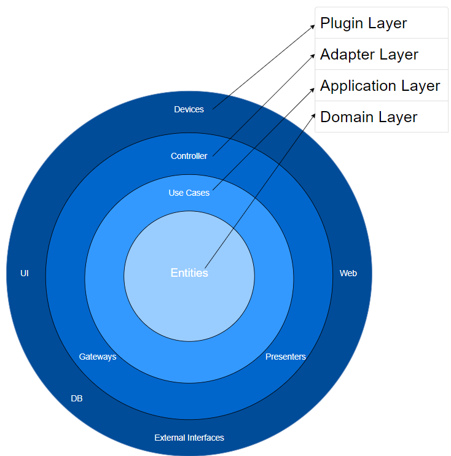

# Streaming de Vídeo API - Tech Challenge fase 4 - Fiap

Este projeto consiste em uma API para um serviço de streaming de vídeo, desenvolvido em Java 17 e utilizando o framework
Spring Boot com o módulo Webflux. O banco de dados utilizado é o MongoDB. A arquitetura do projeto segue os princípios
da Clean Architecture.

## Funcionalidades

### Requisitos Funcionais:

1. Criação, atualização, listagem e exclusão de vídeos.
2. Listagem de vídeos paginada e ordenável por data de publicação.
3. Sistema de marcação de vídeos como favoritos.
4. Categorias para os vídeos e filtragem por categoria na listagem.

## Webflux

O Spring WebFlux é um módulo do Spring Framework que oferece suporte para a criação de aplicativos reativos baseados em
Java. Ele permite construir APIs reativas de forma eficiente, aproveitando ao máximo o modelo de programação reativa.
Uma das principais vantagens de trabalhar com o WebFlux é sua capacidade de lidar com um grande número de conexões de
forma eficiente e escalável, graças ao modelo assíncrono e não bloqueante. Isso significa que a aplicação pode suportar
um grande volume de requisições com um número relativamente pequeno de threads, resultando em um uso mais eficiente dos
recursos do sistema.

## Arquitetura Clean Architecture

A Clean Architecture é uma abordagem para projetar sistemas de software que enfatiza a separação de preocupações e a
independência das camadas. Na arquitetura Clean, o código é dividido em camadas, cada uma com sua própria
responsabilidade claramente definida. As três camadas principais são:

### Adapter

A camada Adapter é responsável por converter os dados da aplicação para formatos específicos de entrada e saída. Ela
lida com detalhes de comunicação externa, como APIs REST, bancos de dados e serviços. Isso permite que a lógica de
negócios da aplicação permaneça independente de detalhes de implementação específicos.

### Application

A camada Application contém os casos de uso da aplicação, ou seja, a lógica de negócios da aplicação. Aqui são definidos
os serviços e operações que a aplicação oferece aos usuários. Essa camada é responsável por coordenar as interações
entre os diferentes componentes da aplicação e garantir que as regras de negócio sejam aplicadas de forma consistente.

### Domain

A camada Domain contém as entidades e regras de negócio da aplicação. Ela representa o coração da aplicação, onde as
principais regras e conceitos do domínio são modelados. Essa camada é independente de qualquer tecnologia ou framework
específico e pode ser reutilizada em diferentes contextos sem modificar sua lógica interna.

## Benefícios de Usar o Webflux

- **Programação Reativa:** O Webflux utiliza um modelo de programação reativa, que permite lidar com um grande número de
  requisições de forma eficiente e escalável, sem a necessidade de alocar um thread para cada conexão. Isso resulta em
  uma utilização mais eficiente dos recursos do sistema e melhor desempenho em situações de alto tráfego.
- **Assincronicidade e Não Bloqueio:** As operações no Webflux são assíncronas e não bloqueantes, o que significa que o
  thread não fica bloqueado esperando a resposta de uma operação de E/S. Isso permite que o thread seja liberado para
  lidar com outras tarefas enquanto aguarda a conclusão da operação, aumentando a capacidade de resposta da aplicação.
- **Suporte a Programação Funcional:** O Webflux suporta programação funcional, o que permite escrever código de forma
  mais concisa e expressiva, facilitando o desenvolvimento e manutenção da aplicação.

## Benefícios de Usar a Arquitetura Clean

- **Separação de Responsabilidades:** A arquitetura Clean separa as responsabilidades da aplicação em diferentes
  camadas, tornando o código mais modular e fácil de entender. Isso facilita a manutenção e evolução da aplicação ao
  longo do tempo.
- **Independência de Tecnologia:** As camadas da arquitetura Clean são independentes de qualquer tecnologia ou framework
  específico, o que permite que elas sejam reutilizadas em diferentes contextos sem modificar sua lógica interna. Isso
  torna a aplicação mais flexível e fácil de adaptar a novos requisitos e tecnologias.
- **Testabilidade:** A separação de responsabilidades e a clara definição das interfaces entre as camadas facilita a
  escrita de testes automatizados para cada componente da aplicação. Isso ajuda a garantir a qualidade e robustez da
  aplicação, permitindo detectar e corrigir problemas de forma rápida e eficiente.

## Como Executar

1. Certifique-se de ter o Java 17 e o MongoDB instalados em seu sistema.
2. Clone este repositório.
3. Importe o projeto em sua IDE preferida.
4. Configure as informações do banco de dados no arquivo `application.properties`.
5. Execute a aplicação.